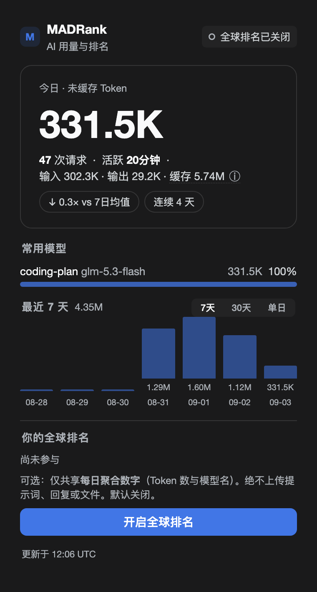
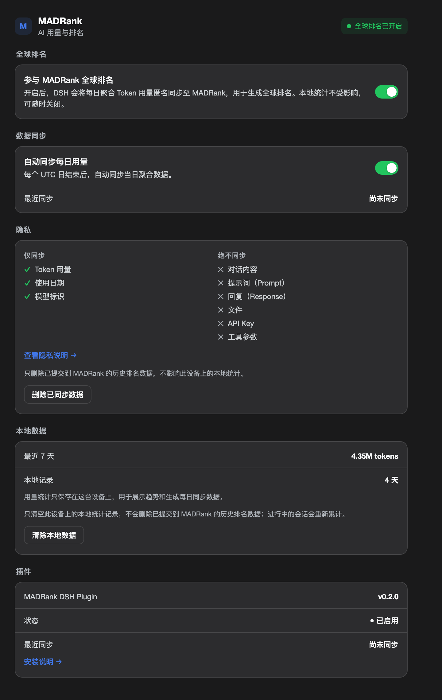

# MADRank for DSH（中文版）

> **统计你的 AI 使用量。看看你排在哪里。**

[](https://www.npmjs.com/package/@qomob/dsh-madrank)
[](./LICENSE)
[](https://madrank.ai)

[English](./README.md) | **简体中文**

MADRank 是一个运行在 **DeepSeek Harness (DSH)** 中的 AI Usage & Ranking 插件。它把你在 DSH 中产生的 AI 使用数据转化为三个层次：

```text
你的 DSH 会话
      ↓
本地 Usage 数据
      ↓
Today / 7 Days / Models / Streak
      ↓
可选加入 MADRank
      ↓
7-Day Token Race
```

它的核心原则很简单：**本地统计默认运行，全球排名明确 opt-in，上传只发生在已结束的 UTC 日，而且只上传聚合后的 usage 数据。**

<p align="center">
  &nbsp;&nbsp;&nbsp;&nbsp;
  
</p>
<p align="center"><sub>左：侧栏 Quick View（真实本地数据）· 右：Settings → MADRank 配置面板</sub></p>

你可以先把它当成一个**私人 AI 使用仪表盘**，也可以选择加入全球排名，看看：

> **过去 7 个 UTC 日，你究竟用了多少 AI Token，以及你排在全球什么位置。**

MADRank 的排名指标不是"模型有多强"，而是**真实 AI 使用量**。

---

## 为什么是 Token Ranking？

今天大家讨论 AI 排名，通常讨论的是 benchmark、模型能力、SWE-Bench、Arena 等。但还有一个非常直接的问题：

> **谁真的在使用 AI？用了多少？**

MADRank 关注的是 Usage Rank：谁每天真的在使用 AI、谁持续使用 AI、谁在过去 7 天产生了最多的有效 Token 使用量。

> **AI Usage Layer，而不是 Model Benchmark Layer。**

---

## 核心功能

**1. 本地 AI Usage Dashboard**（无需加入全球排名）

* **Today** — 今日使用量
* **7-Day / 30-Day History** — 近 7 天 / 30 天历史
* **Top Models** — 使用最多的模型
* **Streak** — 连续使用天数
* **vs 7-Day Average** — 与过去 7 日平均值对比
* **RANK** — 全球排名状态
* **Cached Tokens** — 缓存 Token 单独统计

这些数据来自 DSH 的 session projection feed，而不是读取 DSH 内部数据库。

**2. 7-Day Token Race**（核心竞争指标）

> **7-Day Uncached Tokens**，即最近 **7 个 UTC 日**的 Primary Tokens 总量。

```text
Primary Tokens = uncached input tokens + output tokens
Cached Tokens  = cache read + cache write
```

缓存不会混入主要排名数字，以避免不同模型、不同厂商缓存机制造成的跨模型比较失真。

**3. 全球排名是可选的**

MADRank 默认不上传任何数据。只有你主动开启 **参与全球排名** 之后，插件才会进入同步流程：

* 默认关闭，用户主动 opt-in
* 不上传实时请求，不上传当天数据
* 只上传**已经结束的 UTC 日**的天级聚合数据
* 同步失败不影响本地统计

**4. 一键分享你的 Token Race（Share Card）**

Quick View 卡片上的**分享按钮**会把你的排名变成一个可传播的社交卡片：

* **专属分享链接** — `https://madrank.ai/share/<shareToken>`，任何设备、任何人都能打开查看
* **社交卡片图** — 分享时自动生成专属海报图（服务端动态渲染：7 天 Token 数、全球排名、品牌标识与跳转二维码），在微信 / X / 小红书等平台发布时自动作为卡片配图
* **一键复制的分享文案** — 中 / 英文双语，附排名与模型信息
* **数字以服务器权威数据为准** — 分享前自动向服务器刷新数据（`/api/usage/me`），不会出现本地缓存陈旧导致的数字不一致

分享不是上传新的隐私数据：shareToken 只是你匿名节点的公开寻址标识，榜面数据本就公开。

---

## 隐私设计

MADRank 从架构层面把"本地统计"和"全球同步"分开。

```text
默认状态（离线可用）：
DSH → Local Projection → Local Usage Store → Local Dashboard

加入全球排名后：
Local Usage Store → Finished UTC Day → Aggregated Usage → MADRank Ingest
```

**不会上传：** Prompt、Response、Tool Arguments、单次请求内容、当天实时 usage。
**上传的：** 按日期、按模型聚合后的 usage。

### 数据删除

* **清除本地数据** — 只删除本机 MADRank usage 数据，不影响远端。
* **删除已同步数据** — 请求删除当前安装身份对应的远端 usage 数据。

本地删除和远端删除是两个独立操作。

---

## 数据为什么可信？

MADRank 不自己创造另一套 Token 统计逻辑。它使用 DSH 的 **session projection** 作为数据来源，并通过独立的 reference token-meter 对账。针对真实 DSH session 的回放验证：

```text
input        745,120  =  745,120
output       186,324  =  186,324
cache read 26,352,384 = 26,352,384

MATCH ✓
```

覆盖 streaming replacement、waterfall tool traffic、跨午夜分桶、同 `(turn, step)` 替换语义。目标是：

> **和 DSH 的 Token Meter 保持一致。**

---

## 安装

**方式一：npm（推荐）**

```bash
cd ~/.dsh/profiles/web
pnpm add @qomob/dsh-madrank
```

在 `~/.dsh/profiles/web/cordis.patch.yml` 加入：

```yaml
- insert:
    - name: '@qomob/dsh-madrank'
```

重启 DSH。启动日志出现 `settings ns registered: madrank-usage`、侧栏出现 MADRank 入口即安装成功。

**方式二：GitHub 本地开发**

```bash
git clone https://github.com/qomob/dsh-madrank.git
cd dsh-madrank && npm install && npm run build:client
cd ~/.dsh/profiles/web
pnpm add 'link:/absolute/path/to/dsh-madrank'
```

注意使用 `link:` 而不是 `file:`（`file:` 会复制实体、不再随源码同步）。之后同样注册并重启 DSH。

---

## 使用方式

```text
Sidebar → Quick View = VIEW（看数据）
Settings → MADRank   = CONFIGURE（改配置）
```

Quick View 查看使用情况、7 日趋势、模型分布与 Rank；点击卡片上的分享按钮即可生成专属分享卡片。Settings 负责参与排名开关、自动同步、隐私、本地/远端数据删除与插件状态。

---

## 💬 加入社群

扫码加入 DSH 插件社群——交流 dsh 用法、插件开发与最佳实践：

<div align="center">


</div>

> 微信群二维码有时效；若扫码失效，请到 [Issues](https://github.com/qomob/dsh/issues) 留言，我们会更新二维码。

---

## Architecture

```text
┌──────────────────────┐
│   DSH Session Logs   │
│    Source of Truth   │
└──────────┬───────────┘
           ▼
┌──────────────────────┐
│  sessionProjections  │
│     madrankUsage     │
└──────────┬───────────┘
           ▼
┌──────────────────────┐
│      UsageStore      │
│  local usage cache   │
└──────────┬───────────┘
      ┌────┴─────┐
      ▼          ▼
   Local UI    Daily Sync
                   │
                   ▼
            MADRank Ingest
                   │
                   ▼
           7-Day Token Race
```

* **Framework owns events** — 不创建第二套 session/event subscription，插件只负责 Projection + Fold + Persistence + Sync
* **Session log is the source of truth** — 本地 `usage-store.json` 只是可删除、可重建的 projection cache
* **No direct SQLite access** — 数据采集只通过 `sessionProjections`
* **Sync is isolated** — 同步失败 ≠ 本地统计失败

核心兼容原则：

```text
Never fork DSH
Never read internal SQLite directly
Never duplicate token-meter semantics
Never subscribe to session events independently
Never upload same-day usage
Never upload prompts / responses / tool arguments
Never let global sync block local usage
```

对 DSH 的全部耦合集中在 `src/compat.ts`，可用 `npm run verify:dsh` 验证。

---

## 项目结构

```text
dsh-madrank/
├── src/
│   ├── index.ts              # Host 侧插件入口
│   ├── compat.ts             # DSH 唯一兼容层
│   ├── fold.ts               # Usage Projection / 状态折叠
│   ├── caliber.ts            # Token 数据口径
│   ├── stats.ts              # Dashboard 聚合
│   ├── store.ts              # 本地 Usage Store
│   ├── snapshot.ts           # Card Snapshot
│   ├── sync.ts               # 全球日级同步
│   ├── whoami.ts             # 节点自识别 / 分享令牌
│   ├── global-rank.ts        # Rank 数据处理
│   ├── global-rank-file.ts   # Rank 本地持久化
│   ├── settings-schema.ts    # Settings 契约
│   └── client/
│       ├── index.ts          # Browser / Client 入口
│       ├── panel.ts          # Quick View（含分享动作）
│       ├── settings-panel.ts # Settings
│       ├── card-data.ts      # 卡片数据 / wire 解码
│       ├── card-html.ts      # 卡片渲染 / 分享文案
│       ├── share-modal.ts    # 分享弹窗
│       ├── i18n.ts           # 双语词典
│       └── tick.ts           # 数据 tick / locale
├── tools/                    # token-meter 对账 / 兼容性验证 / client 构建
├── tests/                    # Vitest + golden fixtures
├── dist/                     # 构建产物（browser half）
├── docs/                     # README 截图
├── LICENSE
├── package.json
└── README.md
```

---

## 数据与存储

默认数据目录 `~/.madrank/usage/`，可用 `MADRANK_USAGE_DIR` 覆盖。典型文件：`installation-id`、`usage-store.json`、`card-snapshot.json`、`global-rank.json`、`deleted-epoch`、`cleared-epoch`。匿名安装 ID 是本机生成的 UUID，换机器默认视为新身份。

---

## 开发

```bash
npm install
npm test                  # Vitest
npm run typecheck         # tsc --noEmit
npm run build:client      # 构建 browser half（dist/client.js）
npm run reconcile -- <events.jsonl>   # 真实事件流对账
npm run reconcile:fixture # fixture 对账
npm run verify:dsh        # DSH 兼容性验证
npm run preview           # 用本地真实数据渲染卡片预览页
```

技术栈：TypeScript、React、Zod、Vitest。

---

## 当前状态

本地 usage projection、7 日/30 日历史、Top Models、Streak、Quick View、Settings、本地清除、远端删除、日级聚合同步、golden cases 与真实流量对账、DSH 兼容性验证——**均已完成**。全球排名已接入线上 ingest（madrank.ai）；**分享链路完整可用**：专属分享链接、服务端动态社交卡片图、双语分享文案，分享前通过服务器权威接口（`/api/usage/me`）自动刷新数字。当前版本 v0.3.6。

---

## 相关项目

MADRank 生态不止 DSH 插件：

* **[madrank-node](https://www.npmjs.com/package/@qomob/madrank-node)** — 官方 CLI 采集器：从 Claude Code / Codex / OpenCode / Gemini CLI / DSH 等客户端的本地日志读取使用量，聚合后可选上传，与插件共享同一匿名身份
* **[madrank-sync](https://github.com/qomob/madrank-sync)** — 技能市场分发包：AI agent（Claude Code / DSH 等）通过技能调用采集与上传，携带完整性自校验与防虚报红线

---

## 声明

本站为社区驱动的非官方项目，与 DeepSeek AI 官方无隶属关系。"DeepSeek"、"dsh"、"DeepSeek Harness" 等名称与商标版权归原作者所有。

---

🌐 https://madrank.ai

## License

[MIT](./LICENSE) © 2026 qomob / MADRank

